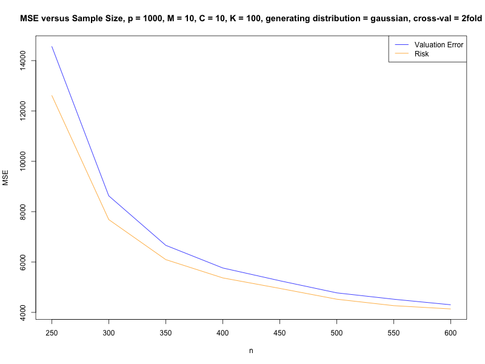

```{r setup, include=FALSE}
knitr::opts_chunk$set(echo = TRUE)
```

# On the cross-validation bias due to unsupervised preprocessing - main code example

In this project, we reproduce the results of the paper **On the cross-validation bias due to unsupervised preprocessing** by Moscovich and Rosset, 2022. In particular, the main example is reproduced, an example which rebuts a claim made in the classic textbook **The Elements of Statistical Learning** by Hastie et al., 2009. Visit [this website](https://academic.oup.com/jrsssb/article/84/4/1474/7073256) for more details.

## Example 

It is easy to produce an example yourself. Simply clone the Github repo into a local repository, and navigate to the folder STATS607_Project1. Some parameters for a quick start are already provided in the script `run_analysis.R`. Simply run

```{r}
source('run_analysis.R')
```

This script will populate the folder results/figures/ with your freshly made graphs!



 You can adjust these parameters as desired in `run_analysis.R`.

## Contact Information

If you have questions about this project, you can reach out to Chandler Nielsen chandle at umich dot edu

## About the Author and this project

This was created by Chandler Nielsen, a PhD student in the department of Statistics at the University of Michigan. This project was completed to satisfy the requirements of Project 1 of the course STATS607 - Advanced Statistical Computing


